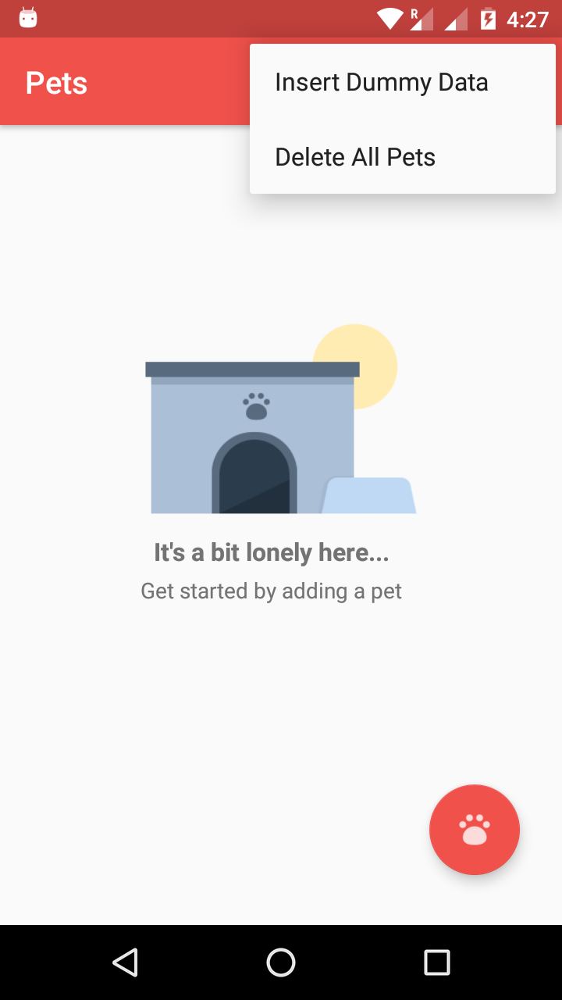
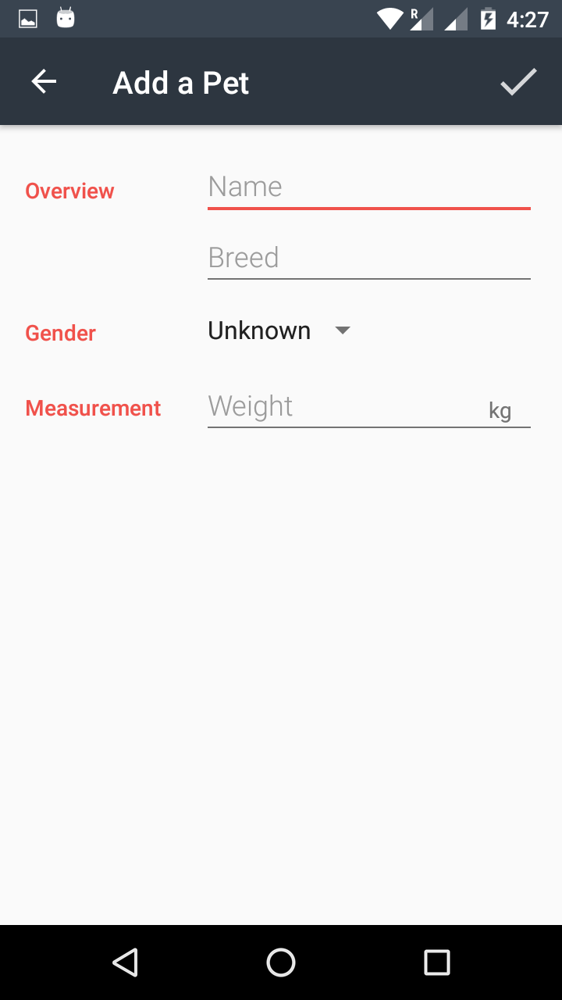
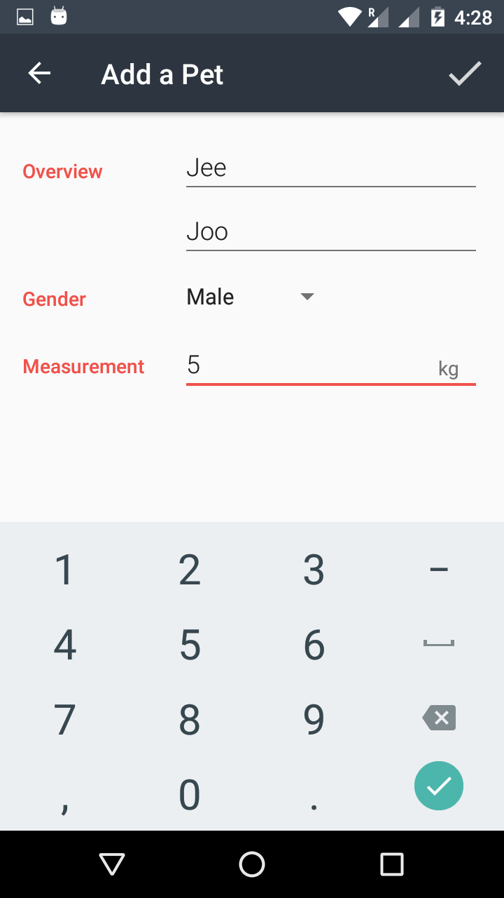
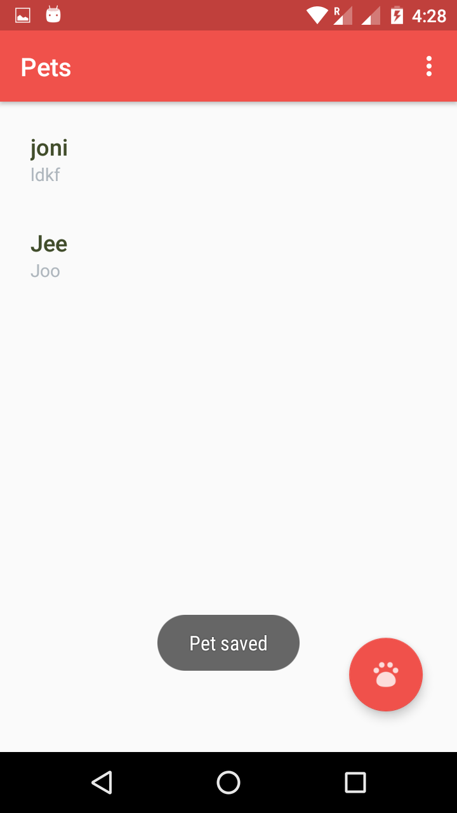
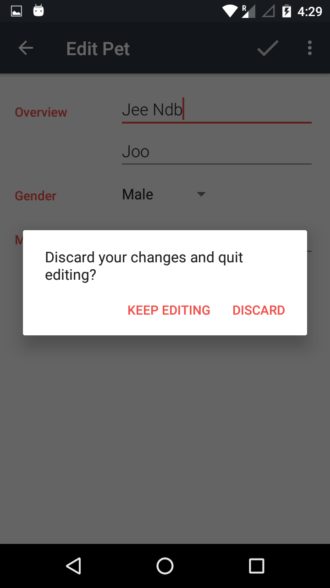

# Pets App (Android architecture components)

This app save data of Pets Like Name,age,Breed,Gender.
It is Made using **Android architecture components**.
**Repository pattern use**.
**Thread Pool use**.This app is part of Udacity android data storage.

Database Operations use:-

1) Insert.
2) Update.
3) Delete.

Android architecture components:-

1) LiveData.
2) ViewModel.
3) Room Persistence Library. 

It also show's you that how to display alertdialog if the user have Click on the EditText View.

## Screenshots:-

  

  
